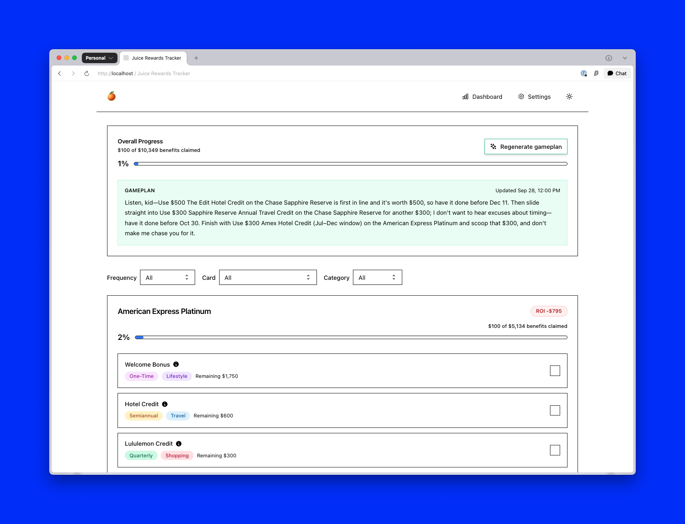

# Juice 🍊

**Maximize your credit card rewards — never leave value on the table.**

Juice is a modern web application that helps you track and optimize credit card benefits. Built with Next.js 14, TypeScript, and Tailwind CSS, it provides a clean interface to monitor your perks, calculate ROI, and ensure you're getting the most value from your cards.


*Track your credit card benefits and maximize ROI with an intuitive dashboard*

## ✨ Features

- **Smart Benefit Tracking** — Pre-loaded benefits for popular premium cards (American Express Platinum, Chase Sapphire Reserve)
- **ROI Dashboard** — Real-time calculations showing value realized vs. annual fees
- **Capture Rate Analysis** — See what percentage of available benefits you're actually using
- **Benefit Completions** — Mark perks as used with amounts, notes, and dates
- **Reset Period Awareness** — Automatically tracks quarterly and annual benefit cycles
- **Currency Support** — View values in your preferred currency
- **Clean, Accessible UI** — Built with shadcn/ui components and best practices

## 🚀 Getting Started

### Prerequisites

- Node.js 18.x or higher
- npm 10.x or higher

### Installation

1. Clone the repository
   ```bash
   git clone https://github.com/xaelophone/juice.git
   cd juice
   ```

2. Install dependencies
   ```bash
   npm install
   ```

3. Run the development server
   ```bash
   npm run dev
   ```

4. Open [http://localhost:3000](http://localhost:3000) in your browser

### Optional: AI Features

To enable AI-powered features, create a `.env.local` file and add your OpenAI API key:

```bash
OPENAI_API_KEY=your_api_key_here
```

## 🏗️ Tech Stack

- **Framework:** Next.js 14 (App Router)
- **Language:** TypeScript
- **Styling:** Tailwind CSS
- **UI Components:** shadcn/ui
- **Icons:** Lucide React, Heroicons
- **Animation:** Framer Motion
- **State Management:** React hooks + localStorage
- **AI Integration:** OpenAI Responses API

## 📁 Project Structure

```
juice/
├── app/                          # Next.js app router pages
│   ├── (onboarding)/            # Onboarding flow
│   ├── (dashboard)/             # Main application screens
│   └── api/                     # API routes
├── components/                   # React components
│   ├── dashboard/               # Dashboard-specific components
│   ├── layout/                  # Navigation and layout
│   ├── settings/                # Settings components
│   └── ui/                      # Reusable UI primitives
├── hooks/                       # Custom React hooks
├── lib/                         # Utilities and helpers
├── data/                        # Card and benefit data
├── styles/                      # Global styles
└── public/                      # Static assets
```

## 🛠️ Available Scripts

- `npm run dev` — Start development server
- `npm run build` — Create production build
- `npm run start` — Start production server
- `npm run lint` — Run ESLint and type checking

## 🎯 Key Concepts

### Cards & Benefits

Cards are pre-configured with their benefits, annual fees, and reset periods. Each benefit has:
- **Cap** — Maximum value available
- **Cadence** — Reset frequency (quarterly, annually)
- **Category** — Type of benefit (travel, dining, credits, etc.)

### ROI Calculation

- **Value Realized** — Total benefit value you've used
- **Potential Value** — Maximum available across all benefits
- **Net ROI** — Value realized minus annual fees
- **Capture Rate** — Percentage of potential value realized

## 🧪 Experimental Features

### AI-Powered Gameplan (Beta)

An experimental feature that uses GPT-5 to generate personalized quarterly strategies for maximizing your card benefits. This feature includes:

- **Personalized Recommendations** — AI analyzes your cards and suggests which benefits to prioritize
- **Quarter Planning** — Get a strategic gameplan for the current quarter
- **Chat Advisor** — Ask questions and get advice on optimizing your benefits
- **Task Suggestions** — Actionable tasks to help you capture more value

To use this feature:
1. Add your OpenAI API key to `.env.local`
2. Navigate to the Dashboard
3. Click the "Generate Gameplan" button in the summary cards section

**Note:** This feature is experimental and requires an OpenAI API key with access to GPT-5. API usage will incur costs based on OpenAI's pricing.

## 🤝 Contributing

This is a personal project, but suggestions and feedback are welcome! Feel free to open an issue if you find bugs or have ideas for improvements.

## 📝 License

This project is open source and available under the MIT License.

## 🙏 Acknowledgments

- UI components inspired by [shadcn/ui](https://ui.shadcn.com/)
- Benefit data sourced from official card issuer websites and NerdWallet

---

**Made with ☕ by Sean X** (and GPT-5)
